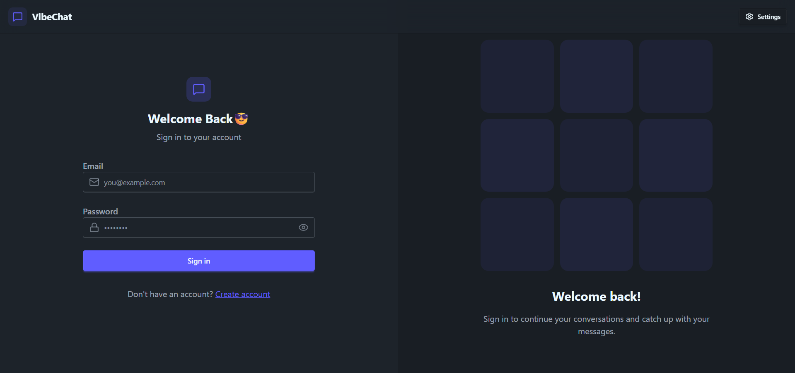
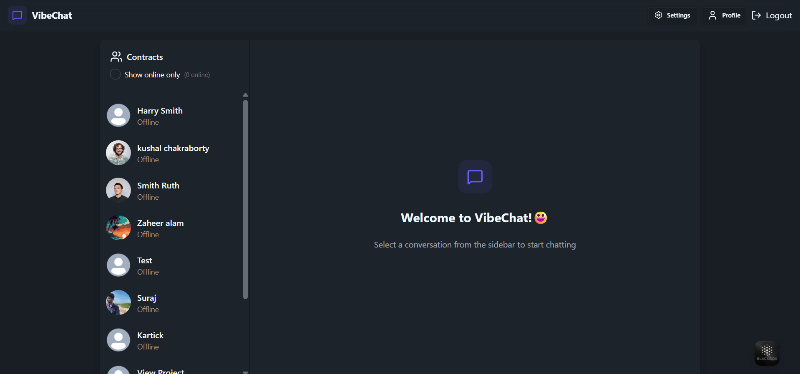
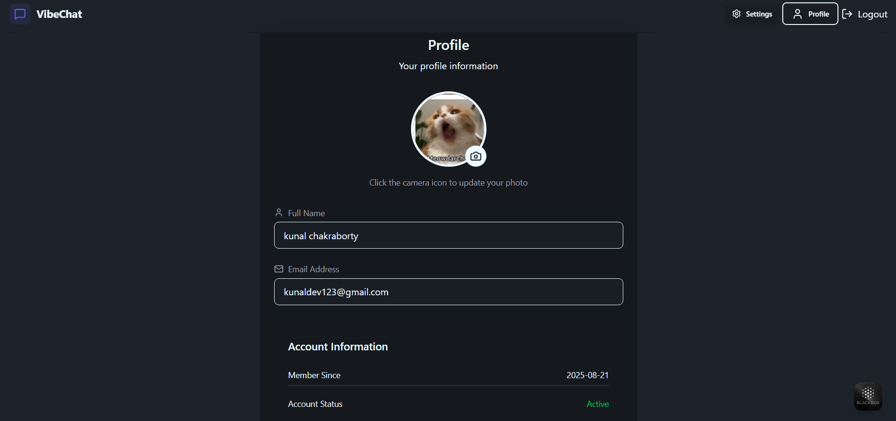

# 💬 Real-Time Chat Application

<p align="center">
  
</p>

---

## 🚀 Features
- 🔐 User Authentication (Login/Register with JWT)
- 💬 Real-time messaging with Socket.IO
- 📷 Image upload support
- 🌓 Dark / Light Theme Toggle
- 🔔 Notifications toggle
- 👥 Online/offline user status
- 📜 Chat history stored in database

---

## 📸 Screenshots

### 🔐 Login Page
<p align="center">
  
</p>

### 💬 Chat Page
<p align="center">
  
</p>

### ⚙️ Profile Page
<p align="center">
  
</p>

---

## 🛠️ Tech Stack
**Frontend**
- React + Vite ⚡
- Zustand (State Management)
- TailwindCSS (UI Styling)
- Lucide Icons

**Backend**
- Node.js + Express.js
- Socket.IO (WebSocket Communication)
- MongoDB (Database)
- JWT Authentication

---

## ⚙️ Installation

Clone the repository:
```bash
git clone https://github.com/your-username/chat-app.git
cd chat-app
